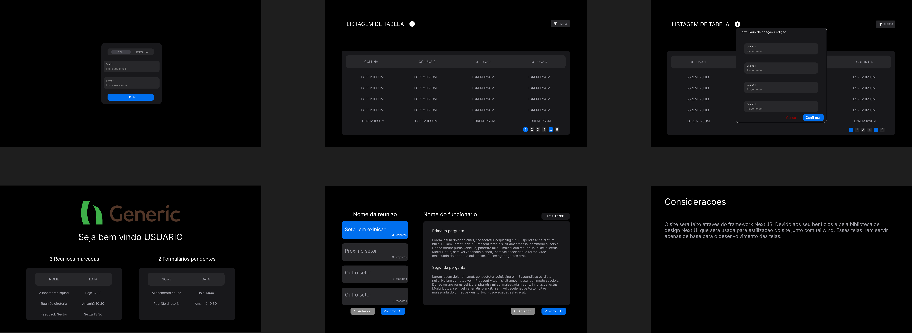

# Projeto Team-Planner

  

Bem-vindo ao repositório do Team-Planner!

  

Siga as instruções abaixo para configurar e executar o projeto em seu ambiente local.

# Explicação sobre o projeto

## Estrutura de pastas

-  **.vscode** - Pasta gerada automaticamente, sua função é apontar a pasta do ts.
-  **components** - Página destinada ao armazenamento de Pure Components do Next, componentes que não precisam das funções do server no Next.
-  **config** - Pasta destinada para armazenar a fonte e algumas informações do site.
- **database** - Responsável por toda conexão ao banco de dados, e armazenar models (ou schemas de um banco relacional). A conexão com o banco e a autenticação é feita pela url do servidor mongo, seja usado através do atlas ou pela instância docker presente no projeto.
- **pages** - Local onde é armazenado as rotas do projeto, tanto da api responsável pelas operações de CRUD e autenticação de usuário quanto as interfaces do site.
- **public** - Pasta gerada  pelo projeto NextUI.
- **style** - Configuração do tailwind.
- **types** - Tipos do projeto.
 - **utils** - Armazenar funções uteis para o projeto.

## Prototipação de telas
 


## Resumo

### Passos realizados
Interfaces de listagem, cadastro e login criados, integração com o banco de dados, autenticação de usuário.

### Próximos passos
Implementar interface de visualização de reunião e realizar melhorias na experiência de usuário.

### Estrutura do projeto
Para visualizar mais detalhes sobre a elaboração do projeto acesse a documentação no arquivo pdf `Projeto Integrador.pdf `

# Instruções para funcionamento do projeto

## Pré-requisitos

  

Certifique-se de ter as seguintes ferramentas instaladas em seu ambiente:

  

-  **pnpm** - Um gerenciador de pacotes rápido e eficiente.

-  **Docker** - Para containerização e fácil gerenciamento de dependências.

  

### Instalando o pnpm

  

Caso ainda não tenha o pnpm instalado, você pode instalá-lo globalmente usando o npm:

  

```bash

npm  install  -g  pnpm

```

  

### Instalando o Docker

  

Para instalar o Docker, siga as instruções no site oficial do Docker para seu sistema operacional: [Docker Documentation](https://docs.docker.com/get-docker/).

  

## Instalando dependências

  

Recomendamos o uso do **pnpm** para gerenciar as dependências do projeto, pois ele é otimizado para melhor velocidade e uso de disco. No entanto, a instalação também funciona com npm.

  

```bash

pnpm  install

```

  

## Configuração com Docker

  

Os arquivos necessários para a configuração do projeto estão localizados no projeto.

  

```bash

docker-compose  up  -d

```

  

## Scripts de Configuração

  

Antes de iniciar o projeto, é crucial executar o script de configuração de ambiente para definir as variáveis necessárias:

  

```bash

./setup.env.sh

```

  

## Populando o banco de dados

  

Após configurar o ambiente, você deve inicializar o banco de dados utilizando o comando de seed para popular o banco com dados de exemplo:

  

```bash

pnpm  run  seed

```

  

## Execução do Projeto

  

Com todas as configurações em ordem, você pode iniciar o projeto com:

  

```bash

pnpm  start

```

  

## Contribuição

  

Se você gostaria de contribuir para este projeto, sinta-se à vontade para abrir pull requests ou issues. Agradecemos por sua colaboração!

  

---

  

Esperamos que essas instruções sejam úteis para você iniciar e executar o Team-Planner.

